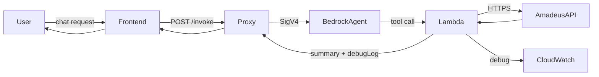

# Lufthansa Agent Reliability Playbook

## Overview
This playbook tracks the current state of the Lufthansa Group travel agent Lambda, the post‑deployment checks we run, and the roadmap for resilience improvements. It accompanies the live TODO list so engineering and operations stay coordinated.

## Current Behaviour
- Lambda `$LATEST` returns enriched offers (carrier, segment detail, itinerary durations).
- Validation failures remain user friendly for travellers; technical details stay in `debugLog` and CloudWatch for operators.
- Manual stress tests confirm the action group returns exactly 3 detailed options per query when inputs are complete.

## Stress-Test Ladder
The automated runner should exercise the agent from simple to highly complex:
1. **Happy Path (Simple)** – Direct city pair with exact dates (e.g., `ZAG → ZRH`, return, economy). Confirms baseline functionality and that carrier/segment metadata survives.
2. **Moderate Complexity** – One-way with connection, budget carrier, no return date (`FRA → BCN`). Validates fare class handling, non-LH partner mapping, and single-tool answer.
3. **Complex Long-Haul** – Multi-leg, premium cabin, long-haul return (`FRA → BOS`) to stress proxy timeouts and itinerary aggregation.
4. **Error Masking Scenario** – Intentionally omit a required input (e.g., missing return date) and ensure the agent asks for clarification without exposing raw errors.
5. **Edge Timeout** – Long-haul with large `max` and tight timeout (`FRA → SYD`, `max=10`) to observe behaviour under latency pressure; runner should expect success or gracefully handled retry guidance.

Each run must log payloads, Lambda status, and result summaries. A build only “passes” when all scenarios succeed; otherwise the deployment must halt and remediation begins.

## Automation & Confidence Policy
- Run the full suite after every code patch. If any test fails or produces unexpected output (e.g., empty offers, diagnostics), **stop** and revert to the last healthy bundle.
- Only promote a patch when the suite succeeds and operator confidence exceeds 95%—that is, no regressions observed across scenarios, and new logic is isolated with unit coverage or manual evidence.
- No auto-deploys while confidence is below the 95% threshold.

## Error Masking Strategy
- Travellers never see raw error codes. Instead the agent offers warm follow-up prompts (“Let’s try those dates again”) while logging full context to CloudWatch/S3 via `debugLog` entries.
- Operators troubleshoot via CloudWatch traces (`_log` entries) and optional S3 archives (future enhancement).

## Workflow Diagram

## Proposed Enhancements
- __Automated Runner__ – Script (`scripts/run_stress_tests.ps1`) to execute the ladder, collect outputs, and fail fast on anomalies.
- __Proxy Timeout Review__ – Evaluate raising the 8 s timeout or streaming responses for Oceania searches.
- __Segment Duration Calculation__ – Compute per-segment duration to satisfy user requests such as “How long is this leg?”.
- __Persona Growth (Bedrock)__ – Coordinate updates to agent instructions for memory/persona tuning (outside Lambda scope).

## Status Tracking
Refer to `TODO.md` for synced, actionable tasks tied to this document. Update both files whenever scope changes so operational knowledge stays current.
